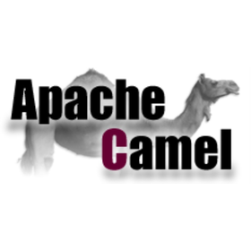

  

# Camel Examples

Some examples of using [Apache Camel](https://camel.apache.org/) and [ActiveMQ](https://activemq.apache.org/).

* **[CamelDSLExample](https://github.wdf.sap.corp/d055125/camel-examples/blob/master/src/main/java/com/mkoch/camel/CamelDSLExample.java)** - *Push a message*

* **[CamelTimerExample](https://github.wdf.sap.corp/d055125/camel-examples/blob/master/src/main/java/com/mkoch/camel/CamelTimerExample.java)** - *Pull messages*

* **[CamelSpringExample](https://github.wdf.sap.corp/d055125/camel-examples/blob/master/src/main/java/com/mkoch/camel/CamelSpringExample.java)** - *Define route using Spring framework*
  
## Versioning

We use [SemVer](http://semver.org/) for versioning. For the versions available, see the [tags on this repository](https://github.com/your/project/tags).

## Contributing

Please read [CONTRIBUTING.md](https://gist.github.com/PurpleBooth/b24679402957c63ec426) for details on our code of conduct, and the process for submitting pull requests to us.

## Author

* **[Marco Koch](mailto:marco.koch@sap.com)** - *Initial work*
